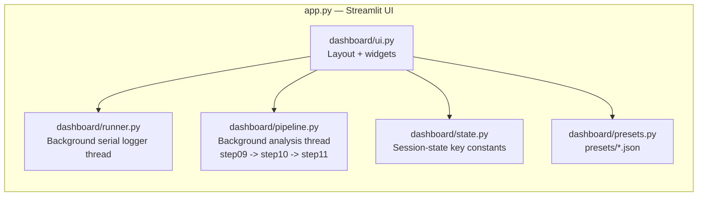
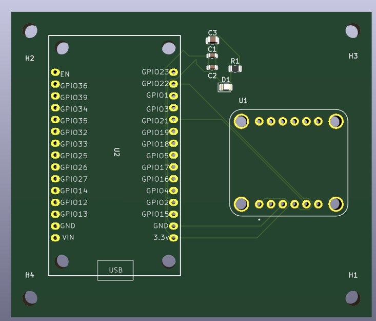

# IMU-Based Vehicle Dynamics Measurement System

**A custom ESP32 + BNO085 IMU pipeline for measuring chassis roll, yaw rate, and lateral acceleration, analyzed against ISO 4138:2021 steady-state circular test procedures**


<!-- TODO: GIF of the Streamlit dashboard running a live test (COM port connect -> logging -> auto-triggered ISO 4138 analysis) -->

---

## Problem Statement

Measuring vehicle handling dynamics — chassis roll, yaw rate, and lateral/longitudinal acceleration — normally requires purpose-built instrumentation (correvit sensors, RTK-GPS/INS units) that is expensive and impractical for a student or hobbyist test program. This project builds that measurement capability from a single low-cost 9-axis IMU: a custom PCB pairs an ESP32 with a BNO085 sensor-fusion IMU, and a from-scratch firmware + analysis pipeline turns its raw output into ISO 4138:2021-compliant Roll Gradient and Yaw Rate Gradient figures, end-to-end through a one-page dashboard.

| Challenge | Approach |
|---|---|
| Reliable I2C sensor link under automotive power conditions | Non-blocking firmware with brown-out/reset auto-recovery ([Step02](Step02_Read_SH2/Step02_Read_SH2.ino)) |
| One consistent sample per instant, not three independently-timed sensor updates | Synchronization gate that only emits a row once rotation, gyro, and accel have all freshly updated ([Step06](Step06_Synchronized_Acquisition/Step06_Synchronized_Acquisition.ino)) |
| Separating vehicle body motion from driver steering corrections and road noise | 4th-order zero-phase Butterworth low-pass filtering at task-specific cutoffs (10 Hz / 2 Hz) |
| Extracting a standards-compliant Roll Gradient from noisy real-world driving | Automated ISO 4138 steady-state window detection + CW/CCW OLS regression with an R² quality gate |
| Validating the analysis math without needing a perfect real-world test | A synthetic dataset generator with a known ground-truth Roll Gradient |
| Running a full test without a terminal | A Streamlit dashboard that wraps logging + analysis in one browser page |

---

## Objectives

- Design a custom 2-layer PCB shield mounting an ESP32 and a BNO085 IMU as a single rigid assembly.
- Build reset-safe, non-blocking ESP32 firmware that streams synchronized, timestamped IMU data as CSV over serial.
- Implement a Python analysis pipeline that converts quaternion output into vehicle-frame Roll/Pitch/Yaw and filtered accelerations.
- Automate ISO 4138:2021 steady-state circular test analysis (Roll Gradient, Yaw Rate Gradient) directly from IMU data.
- Validate the analysis pipeline against a synthetic dataset with a known ground-truth Roll Gradient.
- Ship a Streamlit dashboard that runs the full logging → analysis cycle from one browser page.

---

## Features

| Feature | Description |
|---|---|
| Custom sensor shield | 2-layer KiCad PCB pairing an ESP32 and BNO085 as a matched shield, eliminating loose-wire I2C capacitance/connector failures |
| Reset-safe firmware | Polls `imu.wasReset()` every loop and automatically re-enables sensor reports after an automotive brown-out |
| Synchronized acquisition | A row is only logged once rotation vector, gyroscope, and linear acceleration have all freshly updated |
| Zero-phase filtering | 4th-order Butterworth low-pass (`scipy.signal.filtfilt`) removes chassis vibration and steering corrections without phase lag |
| Automated ISO 4138 analysis | Sliding-window steady-state detection, CW/CCW direction split, OLS regression, and a PASS/FAIL R² ≥ 0.98 quality gate |
| Synthetic validation dataset | Generates a physically-modeled ISO 4138 test CSV with a known ground-truth Roll Gradient to sanity-check the pipeline |
| One-click dashboard | Streamlit UI runs logger → analysis end-to-end with live status, vehicle presets, and per-run figure/result archiving |

---

## System Architecture

```mermaid
flowchart TD
    subgraph HW [Custom PCB — KiCad 2-layer shield]
        A[ESP32 Dev Module] -->|I2C SDA=GPIO22 SCL=GPIO21\n400 kHz Fast-Mode| B[BNO085 IMU\naddr 0x4B]
    end
    B --> C[Step01-07 Firmware\nInit -> Reset Recovery -> Enable Reports\n-> Verify IDs -> Decode -> Sync Gate -> CSV row]
    C -->|USB Serial 115200 baud\nCSV: quat, gyro, linear accel| D[step08_serial_logger.py\nimu_log_YYYYMMDD_HHMMSS.csv]
    D --> E[step09_plots.py\nRaw sensor health: quat, |q|, gyro, accel]
    D --> F[step10_vehicle_dynamics.py\nQuaternion to Euler, rad/s to deg/s,\nm/s^2 to g, 10 Hz Butterworth LPF]
    F --> G[step11_iso4138_analysis.py\n2 Hz LPF -> steady-state windows\n-> CW/CCW regression -> R^2 gate]
    D --> H[Streamlit Dashboard\napp.py]
    E --> H
    G --> H
```



**Data flow:** physical motion → BNO085 MEMS + on-chip EKF sensor fusion → SH-2/SHTP packets over I2C → ESP32 synchronization gate → CSV over USB serial → Python logger → filtering/Euler conversion → steady-state window detection → linear regression → dashboard display.

---

## Hardware

| Component | Role |
|---|---|
| ESP32 Dev Module | I2C master, 240 MHz dual-core, runs firmware Step01–Step07, streams CSV over USB serial |
| BNO085 IMU ([7Semi ES-12242](https://7semi.com/7semi-bno085-9-dof-orientation-imu-fusion-breakout-qwiic/) breakout) | 9-axis sensor-in-package with an on-board Cortex-M0+ running CEVA's SH-2 sensor-fusion firmware; outputs a fused orientation quaternion and gravity-compensated linear acceleration, so the ESP32 never runs its own Kalman filter |
| Custom carrier PCB | 2-layer KiCad shield mounting the ESP32 and BNO085 with correct I2C pull-ups, decoupling, and address/protocol strapping |

<!-- TODO: photo of the assembled PCB + ESP32 + BNO085 shield -->


### I2C Wiring (as implemented — intentionally non-default)

| Signal | ESP32 Pin | Note |
|---|---|---|
| SDA | GPIO 22 | swapped vs. ESP32's usual default, to match the routed PCB |
| SCL | GPIO 21 | swapped vs. ESP32's usual default |
| SA0 | VCC | selects I2C address `0x4B` |
| PS0, PS1 | GND | selects I2C protocol mode |
| Clock speed | — | 400 kHz (Fast Mode) |

### PCB — `esp32_bno085_shield` (KiCad 10.0.4, Pcbnew)

A custom 2-layer shield carries the ESP32 dev module and the BNO085 breakout as one rigid assembly, eliminating the long-wire I2C capacitance and intermittent-connector failure modes of a bench breadboard setup. Fabrication-ready output (Gerber + drill files) is in [`Gerber_PCB/`](Gerber_PCB/).

| Property | Value |
|---|---|
| Board outline | 77.55 mm × 65.55 mm |
| Layers | 2 (F.Cu / B.Cu) |
| Board thickness | 1.6 mm |
| Copper weight | 0.035 mm (1 oz) per layer |
| Dielectric core | FR4, 1.51 mm |
| Solder mask | 0.01 mm, top and bottom |
| Min track / clearance | 0.2 mm (pad-to-pad, pad-to-track, track-to-track) |

Electrical design intent: 10 kΩ I2C pull-ups on SDA/SCL sized for 400 kHz Fast-Mode given the board's trace capacitance; 0.1 µF + 10 µF decoupling at the BNO085's VCC/GND to suppress EKF-core switching noise; SA0/PS0/PS1 strapped on-board (no jumper wires); SDA/SCL routed to match the firmware's GPIO 22/21 mapping.

> The editable KiCad source (`.kicad_pro` / `.kicad_sch` / `.kicad_pcb`) is not currently in this repository — only the exported Gerber/drill fabrication set. <!-- TODO: locate and add the KiCad source project if it can be recovered, so the board can be revised -->

---

## Software

### Embedded Firmware — ESP32 (Step01–Step07)

Built incrementally; each step adds one capability and is verified on hardware before the next. Sketches use the [SparkFun BNO08x Arduino Library](https://github.com/sparkfun/SparkFun_BNO08x_Arduino_Library) (install via Arduino Library Manager).

| Step | Sketch | What it adds |
|---|---|---|
| 01 | [`Step01_BNO085_Initialization`](Step01_BNO085_Initialization/Step01_BNO085_Initialization.ino) | Brings up I2C (`Wire.begin(22,21)`, 400 kHz), opens an SH-2 session with the BNO085 at `0x4B`, reads back firmware/product-ID metadata |
| 02 | [`Step02_Read_SH2`](Step02_Read_SH2/Step02_Read_SH2.ino) | Adds reset recovery — automotive 12 V systems brown out during engine cranking, so `imu.wasReset()` is polled every loop and all reports are re-enabled if the chip resets mid-drive |
| 03 | [`Step03_Enable_Reports`](Step03_Enable_Reports/Step03_Enable_Reports.ino) | Enables the three SH-2 reports needed (Rotation Vector `0x05`, Gyroscope `0x02`, Linear Acceleration `0x04`) and drains the SHTP input queue each loop |
| 04 | [`Step04_Verify_Report_IDs`](Step04_Verify_Report_IDs/Step04_Verify_Report_IDs.ino) | Verifies each report ID is actually arriving at its configured rate before trusting the decoded values |
| 05 | [`Step05_Read_Reports`](Step05_Read_Reports/Step05_Read_Reports.ino) | Decodes quaternion i/j/k/real, gyro XYZ, linear accel XYZ plus per-sensor accuracy/status flags; sanity-checks quaternion magnitude (≈1.0) |
| 06 | [`Step06_Synchronized_Acquisition`](Step06_Synchronized_Acquisition/Step06_Synchronized_Acquisition.ino) | Adds a synchronization gate: a row is only emitted once rotation vector, gyroscope, **and** linear acceleration have all freshly updated |
| 07 | [`Step07_CSV_Logger`](Step07_CSV_Logger/Step07_CSV_Logger.ino) | Final firmware — formats each synchronized sample as a CSV row with a `micros()` timestamp; prefixes diagnostic text with `#` so the Python logger can separate data from log noise |

**Output format (Step07):**
```
Time_us,Quaternion_i,Quaternion_j,Quaternion_k,Quaternion_real,GyroX,GyroY,GyroZ,LinearAccelX,LinearAccelY,LinearAccelZ
464447,-0.0669,0.0311,-0.9920,0.1027,0.0000,0.0000,-0.0020,-0.0234,0.0117,-0.1562
```

Design decisions: no `delay()` in the acquisition loop (non-blocking, to avoid I2C stalls/packet drops); `snprintf` into one fixed buffer per row instead of multiple `Serial.print()` calls, so a full row hits the UART in one transaction; union-safe field access on the SparkFun library's `sh2_SensorValue_t.un` union, reading only the field matching the current `sensorId`.

### Python Analysis Pipeline

| Script | Purpose |
|---|---|
| [`step08_serial_logger.py`](step08_serial_logger.py) | Opens the ESP32 serial port at 115200 baud, waits for the exact CSV header (rejecting boot-time garbage), streams rows to a timestamped `imu_log_YYYYMMDD_HHMMSS.csv` |
| [`step09_plots.py`](step09_plots.py) | 4-panel raw-sensor-health figure: quaternion components, quaternion magnitude `|q|` (sanity check, should sit near 1.0000), gyroscope XYZ, linear acceleration XYZ |
| [`step10_vehicle_dynamics.py`](step10_vehicle_dynamics.py) | Quaternion → Roll/Pitch/Yaw (ZYX Euler), gyro rad/s → deg/s, linear accel m/s² → g, 4th-order Butterworth LPF (10 Hz cutoff) for chassis vibration, 6-panel vehicle-dynamics figure |
| [`step11_iso4138_analysis.py`](step11_iso4138_analysis.py) | ISO 4138 steady-state analysis — see [Methodology](#methodology) |
| [`imu_utils.py`](imu_utils.py) | Shared, side-effect-free helpers: `quaternion_to_euler()`, `butterworth_lpf()` (`scipy.signal.filtfilt`, zero-phase), `find_latest_csv()`, `plots_path()` / `results_path()` |
| [`generatedata.py`](generatedata.py) | Synthetic CSV generator simulating an ISO 4138 constant-radius test with a known ground-truth Roll Gradient — validates the analysis pipeline independent of real hardware noise |

### Streamlit Dashboard

[`app.py`](app.py) launches `streamlit run app.py` (served at `localhost:8501`), wrapping the full firmware → analysis pipeline in one page.

| Module | Responsibility |
|---|---|
| [`dashboard/ui.py`](dashboard/ui.py) | Page layout and all widgets |
| [`dashboard/state.py`](dashboard/state.py) | Centralized session-state key constants (single source of truth for widget↔JSON field mapping) |
| [`dashboard/runner.py`](dashboard/runner.py) | Background-thread serial logger — opens the COM port, waits for the CSV header, streams rows to disk, tracks row count/elapsed time/sample rate live |
| [`dashboard/pipeline.py`](dashboard/pipeline.py) | Background-thread analysis runner — validates the logged CSV, runs Step09 → Step10 → Step11 in sequence, collects results for the UI |
| [`dashboard/presets.py`](dashboard/presets.py) | Saves/loads named vehicle configurations as JSON under [`presets/`](presets/) (e.g. [`HandTest.json`](presets/HandTest.json)) |

**Layout:** a two-column top section (vehicle configuration with input validation + preset save/load; test control with COM port, radius, and a START/STOP button) drives a background logger. When logging finishes, analysis **auto-triggers** — no separate "Analyze" step. Results render across three tabs (Raw Sensor, Vehicle Dynamics, ISO 4138), each showing fresh data, a stale-data fallback from the last saved figure, or a placeholder if nothing has run yet. Every run archives its figures under `plots/` tagged by run name and appends a row to a per-vehicle results CSV under `results/`.

---

## Methodology

### 1. Quaternion → Euler (ZYX convention)

```
roll  = atan2(2(qr·qi + qj·qk),  1 − 2(qi² + qj²))
pitch = asin (clip(2(qr·qj − qk·qi), −1, 1))
yaw   = atan2(2(qr·qk + qi·qj),  1 − 2(qj² + qk²))
```
Gimbal lock at pitch = ±90°. Implemented in [`imu_utils.quaternion_to_euler()`](imu_utils.py).

### 2. Vehicle-Frame Transformation

- Gyro: rad/s → deg/s (`GyroZ` → Yaw Rate)
- Linear acceleration: m/s² → g (÷ 9.81)
- 4th-order Butterworth low-pass, zero-phase (`scipy.signal.filtfilt`) — 10 Hz cutoff for general vehicle-dynamics plotting ([`step10`](step10_vehicle_dynamics.py)), a tighter **2 Hz** cutoff for ISO 4138 analysis specifically, chosen to remove driver steering corrections (1–5 Hz) while preserving body motion (< 1 Hz).

### 3. ISO 4138:2021 Steady-State Circular Test

Implemented in [`step11_iso4138_analysis.py`](step11_iso4138_analysis.py) using IMU data alone (no external speed sensor):

1. **Filter** — roll angle, lateral acceleration, and yaw rate through a 4th-order Butterworth LPF at 2 Hz.
2. **Steady-state window detection** — a sliding ≥2.0 s window is accepted only if:

   | Criterion | Threshold |
   |---|---|
   | Window duration | ≥ 2.0 s |
   | Lateral-accel std | < 0.02 g |
   | Roll std | < 0.5° |
   | Yaw-rate std | < 2.0°/s |
   | Mean \|aᵧ\| | 0.05 g – 0.85 g |

3. **Direction split** — accepted windows separated into CW (aᵧ < 0) and CCW (aᵧ > 0), per the standard's requirement to test both directions.
4. **Linear regression** — OLS fit (`scipy.stats.linregress`) of Roll vs. |aᵧ| gives the **Roll Gradient** (deg/g); a second fit of Yaw Rate vs. |aᵧ| gives the **Yaw Rate Gradient** ((deg/s)/g).
5. **Combine** — CW and CCW gradients are averaged into the reported Roll Gradient, canceling road-camber and sensor Y-axis bias.
6. **Quality gate** — ISO 4138 requires R² ≥ 0.98 for a result to be valid; PASS/FAIL is flagged per direction.
7. **IMU-only speed estimate** — `v = r · |yaw rate|` using the known test-circle radius, a stand-in until a dedicated speed sensor is added.

**Understeer Gradient (UG)** is scaffolded into the vehicle/result schema (CLI args for wheelbase, CG height, CG-to-front, track width, front mass; reserved `ug_*_deg_per_g` result columns) but is **not yet computable** — it requires a steering-angle sensor not yet present on the hardware.

---

## Results

### Synthetic Validation

[`generatedata.py`](generatedata.py) simulates a 422 kg EV656 test vehicle (wheelbase 2.070 m, track 0.875 m, CG height 0.633 m) running an ISO 4138 constant-radius test at R = 10 m, across 5 CW + 5 CCW speed steps (aᵧ = 0.10–0.50 g), with modeled driver-correction, road, and BNO085 sensor noise layered on top of the physics.

| Metric | Value |
|---|---|
| Ground-truth Roll Gradient (built into the generator) | 9.5 deg/g |
| Pipeline-recovered Roll Gradient (CW) | 9.497 deg/g, R² = 0.9996 [PASS] |
| Pipeline-recovered Roll Gradient (CCW) | 9.505 deg/g, R² = 0.9997 [PASS] |
| Pipeline-recovered Roll Gradient (combined CW+CCW) | **9.501 deg/g** — within 0.01% of ground truth |
| Pipeline-recovered Yaw Rate Gradient (CW / CCW) | 56.935 / 56.447 (deg/s)/g, R² = 0.9925 / 0.9913 |
| Steady-state windows detected | 14 (6 CW, 8 CCW) out of 10,440 synthetic samples |

### Real-Vehicle Testing

| Metric | Value |
|---|---|
| Real hardware logging sessions recorded | 14 (8 on 2026-06-29, 2 on 2026-06-30, 1 on 2026-07-07, 4 on 2026-07-09) |
| Valid ISO 4138 steady-state windows achieved to date | 0 across all sessions |
| Real-vehicle Roll Gradient / Yaw Rate Gradient | <!-- TODO: pending a test run with a longer, steadier constant-radius segment --> |

No real-world session has yet contained a segment stable enough to satisfy the ISO 4138 acceptance thresholds (±0.02 g lateral-accel std, ±0.5° roll std, ±2.0°/s yaw-rate std, sustained ≥2.0 s) — the pipeline itself has not produced a passing real-world window, so this is scoped as a test-execution gap (longer, steadier circles at the track) rather than a software defect.

---

## Folder Structure

```
IMU-Based-Vehicle-Dynamics-Measurement-System/
├── app.py                              Streamlit entry point
├── dashboard/                          UI package (ui, state, runner, pipeline, presets)
├── Gerber_PCB/                         KiCad-exported fabrication files (esp32_bno085_shield)
├── Step01_BNO085_Initialization/       ESP32 firmware — I2C + SH-2 bring-up
├── Step02_Read_SH2/                    ESP32 firmware — reset recovery
├── Step03_Enable_Reports/              ESP32 firmware — enable SH-2 reports
├── Step04_Verify_Report_IDs/           ESP32 firmware — verify report rates
├── Step05_Read_Reports/                ESP32 firmware — decode payloads
├── Step06_Synchronized_Acquisition/    ESP32 firmware — synchronization gate
├── Step07_CSV_Logger/                  ESP32 firmware — final CSV logger
├── step08_serial_logger.py             Serial -> CSV logger
├── step09_plots.py                     Raw sensor health plots
├── step10_vehicle_dynamics.py          Quaternion -> vehicle-frame dynamics + filtering
├── step11_iso4138_analysis.py          ISO 4138 steady-state Roll/Yaw-Rate Gradient analysis
├── imu_utils.py                        Shared math/IO helpers
├── generatedata.py                     Synthetic ISO 4138 dataset generator (validation)
├── presets/                            Saved vehicle configuration JSON files
├── Vehicle_Dynamics_IMU_Handbook.md    12-chapter first-principles engineering handbook
├── report.md                           Full project report
├── LICENSE                             MIT license
└── requirements.txt                    Python dependencies
```

> Raw IMU logs (`imu_log_*.csv`), analysis figures (`plots/`), and results history (`results/`) are not tracked in this repo — see `.gitignore`. Running the pipeline regenerates them locally.

---

## Installation

### 1. Clone the repository

```bash
git clone https://github.com/kanak1506/IMU-Based-Vehicle-Dynamics-Measurement-System.git
cd IMU-Based-Vehicle-Dynamics-Measurement-System
```

### 2. Flash the firmware

Install the [SparkFun BNO08x Arduino Library](https://github.com/sparkfun/SparkFun_BNO08x_Arduino_Library) via the Arduino Library Manager, wire the BNO085 per [I2C Wiring](#i2c-wiring-as-implemented--intentionally-non-default) above, and flash `Step01`–`Step07` to the ESP32 in order, verifying each stage on hardware before moving to the next.

### 3. Set up the Python environment

```bash
python -m venv venv
source venv/bin/activate        # Linux/macOS
venv\Scripts\activate           # Windows

pip install -r requirements.txt
```

---

## Usage

### Run the dashboard (recommended)

```bash
streamlit run app.py
```
Set the COM port and test radius, click **START TEST**, drive the maneuver, click **STOP TEST** — analysis runs automatically and results appear in the Raw Sensor / Vehicle Dynamics / ISO 4138 tabs.

### Run the pipeline from the command line

```bash
python step08_serial_logger.py                 # logs to imu_log_YYYYMMDD_HHMMSS.csv
python step09_plots.py
python step10_vehicle_dynamics.py
python step11_iso4138_analysis.py \
    --name EV656 --mass 422 --wheelbase 2.07 \
    --cg-height 0.633 --cg-front 1.2508 \
    --track-width 0.875 --front-mass 159 --radius 10
```

### Validate against the synthetic dataset

```bash
python generatedata.py                          # writes imu_log_synthetic_EV656_ISO4138.csv
python step11_iso4138_analysis.py --csv imu_log_synthetic_EV656_ISO4138.csv --name EV656 --radius 10
```

---

## Future Improvements

| Improvement | Rationale |
|---|---|
| Add a steering-angle sensor | Unblocks Understeer Gradient, which is schema-ready but not yet computable |
| Longer, steadier constant-radius test runs at the track | No real-world session has yet produced a valid (R² ≥ 0.98) steady-state window |
| Recover/back up the editable KiCad source (`.kicad_pro/.kicad_sch/.kicad_pcb`) | Only the exported Gerber/drill set currently survives in this repo; needed to revise the board |
| Replace the IMU-only speed estimate with a dedicated speed sensor (wheel speed / GPS) | `v = r · |yaw rate|` assumes a perfect constant-radius circle |
| CI badge / automated pipeline smoke test on the synthetic dataset | Would catch regressions in the ISO 4138 regression math automatically |

---

## Lessons Learned

- **Blocking calls break real-time acquisition** — early I2C stalls and packet drops traced back to `delay()` calls in the loop; the firmware was rewritten to be fully non-blocking.
- **Synchronization matters more than sample rate** — logging each sensor independently produced misleading rows; gating on all three reports being fresh (Step06) was what made the vehicle-frame math trustworthy.
- **Automotive power is not clean 5V/3.3V** — engine-cranking brown-outs reset the BNO085 mid-drive; reset detection and auto re-enable (Step02) turned out to be a hardware-correctness requirement, not an edge case.
- **Filter cutoff choice is a modeling decision, not a default** — 10 Hz is appropriate for general dynamics visualization, but ISO 4138 gradient regression needed a tighter 2 Hz cutoff to reject driver steering corrections without discarding real body motion.
- **A synthetic ground-truth dataset is essential before trusting real data** — it separates "is the regression math correct?" from "did this drive produce steady-state data?", and made it clear the current real-world gap is in test execution, not the pipeline.
- **Real-world steady-state is harder to achieve than it looks** — 14 logged sessions and zero passing ISO 4138 windows shows the acceptance thresholds (0.02 g / 0.5° / 2.0°/s std) demand a level of driving consistency that bench/road testing hadn't yet hit.

---

## References

| Resource | Link |
|---|---|
| BNO085 official datasheet (CEVA) | https://www.ceva-ip.com/wp-content/uploads/BNO080_085-Datasheet.pdf |
| 7Semi ES-12242 BNO085 breakout | https://7semi.com/7semi-bno085-9-dof-orientation-imu-fusion-breakout-qwiic/ |
| SparkFun BNO08x Arduino Library | https://github.com/sparkfun/SparkFun_BNO08x_Arduino_Library |
| ISO 4138:2021 — Passenger cars, steady-state circular driving behaviour | https://www.iso.org/standard/81710.html |
| Milliken & Milliken — *Race Car Vehicle Dynamics* | — |
| Gillespie — *Fundamentals of Vehicle Dynamics* | — |
| Lee & Seshia — *Introduction to Embedded Systems* | — |
| [Vehicle_Dynamics_IMU_Handbook.md](Vehicle_Dynamics_IMU_Handbook.md) | 12-chapter first-principles deep-dive (I2C timing, MEMS physics, SH-2/SHTP, quaternion/filter derivations) — in this repo |
| [report.md](report.md) | Full project report (architecture, hardware, results, status) — in this repo |

---

## License

[MIT](LICENSE) © 2026 Kanak Potdar
